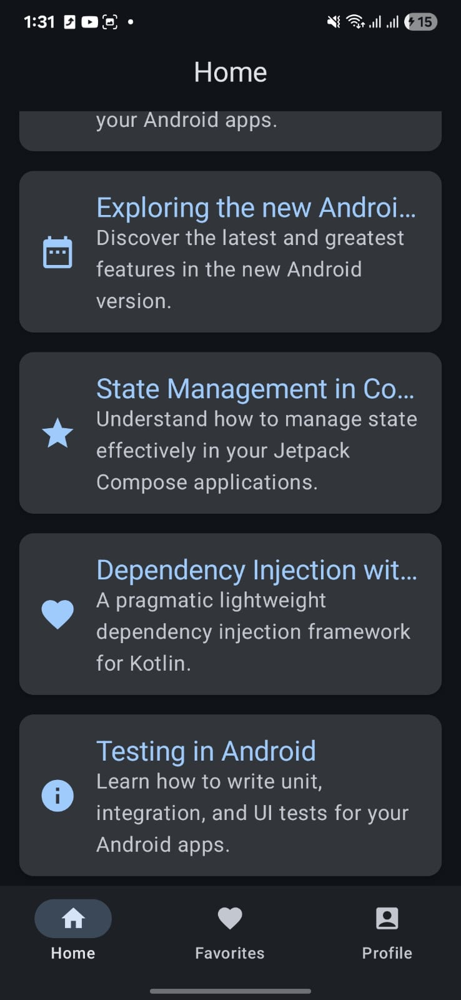
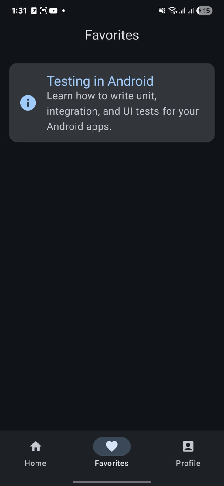

# Android AI Experiment — Built with Gemini in Android Studio

This project is part of my personal experiment with **AI-powered Android development** using the latest features in **Android Studio** and **Gemini integration**. Almost the entire app was generated by Gemini — I only made a few small manual edits.  

<table align="center">
  <tr>
    <td align="center"></td>
    <td align="center"></td>
    <td align="center"></td>
  </tr>
</table>

---

## About the Project

I wanted to test how far Gemini can go in helping Android developers build real apps.  
So I tried creating a simple app with **3 Compose screens**, each showing articles and UI components like **Cards, Icons, and Text**.

I described each screen in plain English — and Gemini generated:  
- The full **Compose UI code**  
- **Static data** for each screen  
- **Separate files** for each screen automatically  

In the end, I had a working app without writing almost any code by hand. 😄  

---

## Features I Tested

### 1. Journeys for Android Studio

**Journeys** is an experimental feature that lets developers write end-to-end UI tests using **natural language** with Gemini.  
It’s an exciting step toward AI-driven automation and smarter app validation.

#### How to Try It Yourself

##### 1. Prepare Your Environment
- Use the **latest Canary version** of [Android Studio](https://developer.android.com/studio/preview).  
- Sign into your **developer account** and **enable Gemini** in Android Studio.  
- Make sure you have the **Java/Kotlin toolchain** and **Android SDK** installed.

##### 2. Create a Journey File
1. In the **Project panel**, right-click your app module.  
2. Select **New > Test > Journey File**.  
3. In the dialog, enter the **journey’s name and description**.  
4. Click **OK** to create an XML journey file.

##### 3. Describe Steps in the Journey
- Open the journey file (in **Code** or **Design view**).  
- Use the editor to describe each step in **natural language**.  
- Include both **actions** and **assertions** (e.g., “Verify that,” “Assert that”).  
- Press **Enter** to add new steps or prompts.  

Tips:  
- Clearly separate actions from assertions.  
- For actions, be explicit (e.g., “Tap on ‘Login’,” “Swipe left to reveal settings”).  
- Avoid unsupported interactions like multi-finger gestures for now.

##### 4. Run the Journey
1. Select a **target device** from the toolbar.  
2. Open the journey XML file in the editor.  
3. In **Design view**, click **Run Journey**; or in **Code view**, click **Run** next to the journey name.  
4. Android Studio will build, deploy, and run your app — Gemini interprets and executes the described steps.

##### 5. View Results
After the test runs, a results panel shows:  
- Screenshots of each step  
- Actions performed  
- Assertions checked  
- Gemini’s reasoning for each action  

These steps let you build **resilient, easy-to-maintain end-to-end UI tests** using natural language, powered by Gemini’s AI in Android Studio.

---

### 2. From Text to Full Compose Screens

Describe a screen in English, and Gemini creates it — including UI, layout, and data.

---

### 3. Automated Dependency Updates

Gemini can now analyze and update project dependencies automatically, fixing build errors too.

---

## My Thoughts

This experiment showed me how much AI is changing Android development.  
Gemini is not just a chatbot anymore — it’s part of the full workflow.  
It helps developers save time, reduce repetitive work, and focus on building better apps.
